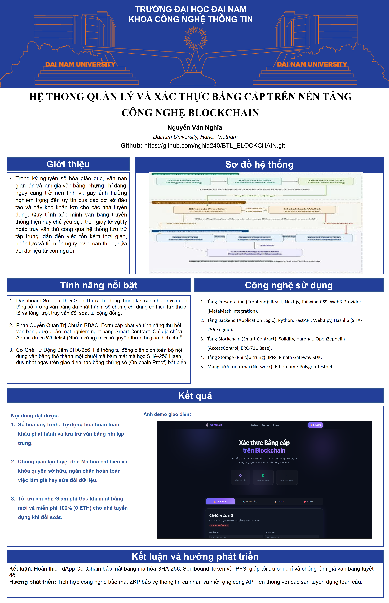

<div align="center">

# ⛓️ CERTCHAIN

### Hệ thống Quản lý và Xác thực Văn bằng Học thuật trên Blockchain


**Bài tập lớn môn Công nghệ Blockchain — Trường Đại học Công nghệ Thông tin (UIT)**

</div>

---

## 🎨 Poster Dự án

<p align="center">
  
</p>

---

## 📖 Giới thiệu

**CertChain** là ứng dụng phi tập trung (dApp) trên Ethereum Blockchain, giải quyết bài toán **giả mạo văn bằng học thuật**:

- **Ghi nhận bất biến** thông tin văn bằng lên Blockchain (immutable)
- **Mã hóa nội dung** bằng **Keccak-256** trước khi lưu trữ, bảo vệ thông tin cá nhân
- Cho phép **bất kỳ ai** xác thực tính hợp lệ **không cần bên thứ ba**
- Hỗ trợ **thu hồi** văn bằng khi phát hiện sai phạm

---

## ⚡ Tính năng cốt lõi

| Tab | Chức năng | Quyền |
| :--- | :--- | :---: |
| 📜 **Cấp bằng mới** | Phát hành văn bằng lên Blockchain | 🔐 Admin |
| 🔍 **Xác thực bằng** | Kiểm tra tính toàn vẹn bằng so khớp hash | 🌐 Công khai |
| 📋 **Tra cứu** | Xem chi tiết thông tin bằng cấp | 🌐 Công khai |
| 🚫 **Thu hồi** | Hủy hiệu lực bằng cấp (không thể hoàn tác) | 🔐 Admin |

**Các tính năng bổ sung:**
- Dashboard giám sát real-time (bằng đã cấp, đang hiệu lực, lượt xác thực)
- Hash preview real-time khi nhập nội dung bằng
- Tích hợp ví MetaMask với tự động chuyển mạng
- Toast notification & nhật ký giao dịch

---

## 🏗️ Kiến trúc Hệ thống

```text
┌─────────────────────────────────────────────────────────┐
│                      🖥️ FRONTEND                         │
│         HTML5 + CSS3 + JavaScript + Ethers.js            │
│                                                         │
│   [Cấp bằng] [Xác thực] [Tra cứu] [Thu hồi]            │
│         │          │         │         │                 │
│         └──────────┴─────────┴─────────┘                 │
│                    │                                     │
│         Keccak-256 Hashing (Client-side)                 │
└────────────────────┼────────────────────────────────────┘
                     │  JSON-RPC via MetaMask
                     ▼
┌─────────────────────────────────────────────────────────┐
│                  ⛓️ BLOCKCHAIN LAYER                      │
│          Ethereum (Hardhat Local / Sepolia)               │
│                                                         │
│   📝 CertificateManager.sol                              │
│   • issueCertificate()   → Cấp bằng (write)             │
│   • verifyCertificate()  → Xác thực (view, 0 gas)       │
│   • getCertificate()     → Tra cứu (view, 0 gas)        │
│   • revokeCertificate()  → Thu hồi (write)              │
│   • transferAdmin()      → Chuyển quyền Admin (write)   │
└─────────────────────────────────────────────────────────┘
```

---

## 📂 Cấu trúc Dự án

```
BTL_Blockchain/
├── contracts/
│   └── CertificateManager.sol    # Smart Contract chính
├── scripts/
│   └── deploy.js                 # Script deploy contract
├── test/
│   └── CertificateManager.test.js
├── frontend/
│   ├── index.html                # Giao diện chính
│   ├── style.css                 # Stylesheet
│   ├── app.js                    # Logic + Web3 integration
│   └── contract-address.json     # Địa chỉ contract (auto-generated)
├── Poster/
│   └── poster.png
├── hardhat.config.js
├── package.json
├── start.bat                     # Script khởi động nhanh (Windows)
└── .env                          # Private Key, RPC URL
```

---

## 📜 Smart Contract

### Cấu trúc Certificate

```solidity
struct Certificate {
    string certificateId;       // Mã định danh (VD: "CERT-2024-001")
    string studentName;         // Tên sinh viên
    string degree;              // Cử nhân / Kỹ sư / Thạc sĩ / Tiến sĩ
    string major;               // Chuyên ngành
    uint256 issueDate;          // Ngày cấp (Unix timestamp)
    bytes32 contentHash;        // Hash Keccak-256
    CertificateStatus status;   // NotExist(0) | Active(1) | Revoked(2)
    address issuedBy;           // Địa chỉ ví người cấp
}
```

### Các hàm chính

| Hàm | Loại | Quyền | Mô tả |
| :--- | :---: | :---: | :--- |
| `issueCertificate()` | write | Admin | Cấp bằng mới, lưu hash lên chain |
| `verifyCertificate()` | view | Public | So khớp hash để xác thực |
| `getCertificate()` | view | Public | Truy xuất thông tin bằng cấp |
| `revokeCertificate()` | write | Admin | Thu hồi bằng (không hoàn tác) |
| `transferAdmin()` | write | Admin | Chuyển quyền Admin |

### Gas & Phí giao dịch

| Hành động | Loại | Phí Gas |
| :--- | :---: | :---: |
| Xác thực / Tra cứu | `view` | **0 ETH** |
| Cấp bằng / Thu hồi | `write` | **Cực nhỏ** (miễn phí trên Testnet) |

---

## 🛠️ Yêu cầu Hệ thống

- [Node.js](https://nodejs.org/) >= 16.x
- [MetaMask](https://metamask.io/) (extension trình duyệt)
- Trình duyệt: Chrome / Firefox / Edge

---

## 🚀 Hướng dẫn Cài đặt

### Cách 1: Khởi động nhanh (Windows)

```bash
git clone https://github.com/nghia240/BTL_BLOCKCHAIN.git
cd BTL_BLOCKCHAIN
start.bat
```

Script sẽ tự động: cài dependencies → compile → chạy Hardhat Node → deploy → mở trình duyệt.

### Cách 2: Cài đặt thủ công

```bash
# 1. Clone & cài đặt
git clone https://github.com/nghia240/BTL_BLOCKCHAIN.git
cd BTL_BLOCKCHAIN
npm install

# 2. Khởi chạy Hardhat Node (giữ terminal mở)
npx hardhat node

# 3. Deploy contract (terminal mới)
npx hardhat run scripts/deploy.js --network localhost

# 4. Khởi chạy Frontend
npx -y http-server ./frontend -p 3000 -c-1 --cors
```

Truy cập: **http://127.0.0.1:3000**

---

## 🦊 Cấu hình MetaMask

### Thêm mạng Hardhat Local

| Trường | Giá trị |
| :--- | :--- |
| Network Name | `Hardhat Local` |
| RPC URL | `http://127.0.0.1:8545` |
| Chain ID | `31337` |
| Symbol | `ETH` |

### Import tài khoản Admin

Mở MetaMask → **Import Account** → dán Private Key của Account #0:
```
0xac0974bec39a17e36ba4a6b4d238ff944bacb478cbed5efcae784d7bf4f2ff80
```

> ⚠️ Private Key trên chỉ dùng cho mạng test. **KHÔNG** dùng cho mạng Mainnet.

---

## 📘 Hướng dẫn Sử dụng

1. **Kết nối ví** — Nhấn 🦊 **Kết nối Ví** trên Header, MetaMask tự chuyển mạng Hardhat
2. **Cấp bằng** — Tab 📜, điền thông tin → xem hash preview → xác nhận trên MetaMask
3. **Xác thực** — Tab 🔍, nhập mã bằng + nội dung gốc → kết quả ✅ hợp lệ / ❌ giả mạo
4. **Tra cứu** — Tab 📋, nhập mã bằng → xem toàn bộ thông tin chi tiết
5. **Thu hồi** — Tab 🚫, nhập mã bằng → xác nhận cảnh báo → xác nhận MetaMask

---

## 🧪 Chạy Test

```bash
npx hardhat test
```

---

## 🔒 Bảo mật

| Biện pháp | Mô tả |
| :--- | :--- |
| Access Control | Modifier `onlyAdmin` kiểm soát quyền cấp/thu hồi |
| Hash-only Storage | Chỉ lưu hash trên chain, không lưu dữ liệu gốc |
| Client-side Hashing | Dữ liệu được hash trên trình duyệt trước khi gửi |
| Zero Address Check | Kiểm tra `address(0)` khi chuyển quyền Admin |

---

## 🛡️ Công nghệ

| Công nghệ | Vai trò |
| :--- | :--- |
| Solidity `0.8.19` | Smart Contract |
| Hardhat `2.22.x` | Framework phát triển & test |
| Ethers.js `5.7.2` | Thư viện tương tác Blockchain |
| HTML5 + CSS3 + JS | Giao diện người dùng |
| MetaMask | Ví Web3 |
| Google Fonts (Inter) | Typography |

---

## ❓ Troubleshooting

<details>
<summary><b>MetaMask: "Nonce too high"</b></summary>
MetaMask → Settings → Advanced → <b>Clear Activity Tab Data</b>
</details>

<details>
<summary><b>Không load được contract</b></summary>
Đảm bảo Hardhat Node đang chạy → deploy lại: <code>npx hardhat run scripts/deploy.js --network localhost</code>
</details>

<details>
<summary><b>Port 8545/3000 bị chiếm</b></summary>
<code>netstat -ano | findstr :8545</code> → <code>taskkill /f /pid &lt;PID&gt;</code>
</details>

<details>
<summary><b>Lỗi "Chi Admin moi co quyen"</b></summary>
Đảm bảo đang dùng đúng Account #0 (tài khoản deploy contract) trong MetaMask.
</details>

---

<div align="center">

**Trường Đại học Công nghệ Thông tin — ĐHQG TP.HCM (UIT)**

⭐ Nếu hữu ích, hãy cho một **Star** trên GitHub!

</div>
